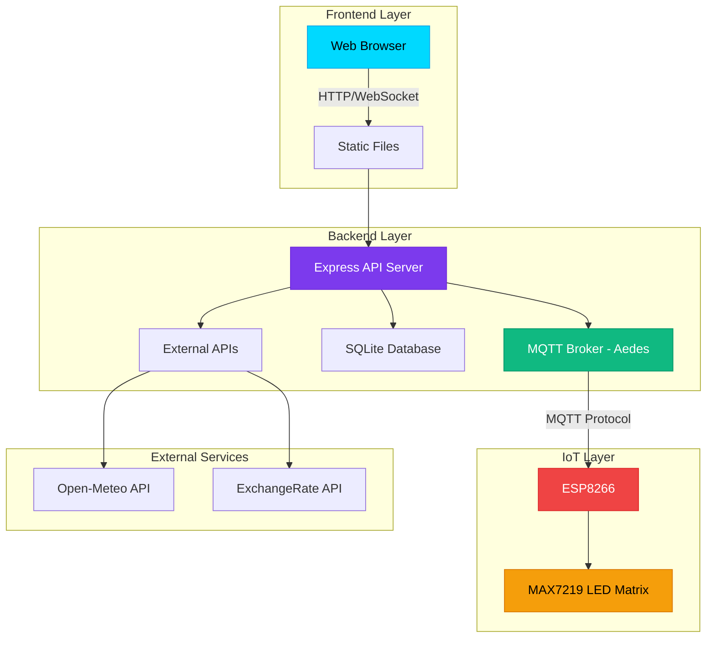

<div align="center">

# 🌐 IoT LED Matrix Control System

### _Hệ thống IoT thông minh điều khiển LED Matrix qua MQTT_

[](https://nodejs.org/)
[](https://www.espressif.com/)
[](https://mqtt.org/)
[](https://www.sqlite.org/)
[](LICENSE)


---

### 🎯 **Dự án IoT hoàn chỉnh với kiến trúc hiện đại**

Hiển thị **thời tiết**, **tỉ giá tiền tệ**, và **custom messages** trên LED Matrix MAX7219  
Điều khiển qua **Web Dashboard** với giao diện đẹp mắt và responsive

[🚀 Bắt đầu](#-cài-đặt-nhanh) • [📖 Tài liệu](#-tài-liệu-chi-tiết) • [🎥 Demo](#-demo--screenshots) • [🤝 Đóng góp](#-đóng-góp)

</div>

---

## 📑 **Mục lục**

- [✨ Tính năng nổi bật](#-tính-năng-nổi-bật)
- [🏗️ Kiến trúc hệ thống](#️-kiến-trúc-hệ thống)
- [🎥 Demo & Screenshots](#-demo--screenshots)
- [🚀 Cài đặt nhanh](#-cài-đặt-nhanh)
- [📖 Tài liệu chi tiết](#-tài-liệu-chi-tiết)
- [🌐 Deploy Production](#-deploy-production)
- [🔧 Troubleshooting](#-troubleshooting)
- [💡 Roadmap & Mở rộng](#-roadmap--mở-rộng)
- [🤝 Đóng góp](#-đóng-góp)

---

## ✨ **Tính năng nổi bật**

<table>
<tr>
<td width="50%">

### 🌤️ **Thời tiết thời gian thực**

- Tích hợp **Open-Meteo API**
- Cập nhật tự động mỗi 5 phút
- Hiển thị: Nhiệt độ, độ ẩm, áp suất, gió
- Tùy chỉnh vị trí (lat/lon)

### 💱 **Tỉ giá tiền tệ**

- Hỗ trợ **6 loại tiền**: VND, EUR, GBP, JPY, CNY, AUD
- Cross-currency conversion thông minh
- API key support (ExchangeRate-API)
- Cập nhật tự động mỗi 10 phút

### 📱 **Web Dashboard**

- Giao diện **Dark Theme** hiện đại
- Responsive design (mobile-friendly)
- Real-time status monitoring
- Logs viewer với filter

</td>
<td width="50%">

### 🎮 **Điều khiển LED**

- **3 chế độ hiển thị**: Scroll Left/Right, Blink
- Điều chỉnh **tốc độ** (0-100)
- Điều chỉnh **độ sáng** (0-15)
- Custom messages với emoji support

### 🤖 **AUTO Mode**

- Tự động hiển thị tuần tự:
  - ⏰ Thời gian hiện tại
  - 🌤️ Thời tiết
  - 💱 Tỉ giá (6 loại tiền)
- Tùy chỉnh interval (mặc định 5s)

### 📊 **Lưu trữ & Logs**

- **SQLite** database
- Lịch sử thời tiết, tỉ giá, messages
- MQTT logs với timestamp
- Export data support

</td>
</tr>
</table>

---

## 🏗️ **Kiến trúc hệ thống**



### 🔄 **Luồng dữ liệu**

```
┌─────────────────────────────────────────────────────────────┐
│  1. Data Collection (Cron Jobs)                             │
│     Weather API ──┐                                         │
│     Exchange API ─┼──► Backend ──► SQLite ──► MQTT Publish │
└───────────────────┴─────────────────────────────────────────┘
                                                    │
                                                    ▼
┌─────────────────────────────────────────────────────────────┐
│  2. MQTT Distribution                                        │
│     Topics: home/weather/led, home/exchange/led, etc.       │
└─────────────────────────────────────────────────────────────┘
                                                    │
                    ┌───────────────────────────────┼───────────────┐
                    ▼                               ▼               ▼
            ┌───────────────┐            ┌──────────────┐  ┌──────────────┐
            │   ESP8266     │            │  Web Client  │  │  Database    │
            │  LED Display  │            │  (Frontend)  │  │  (Logs)      │
            └───────────────┘            └──────────────┘  └──────────────┘
```

---

## 🎥 **Demo & Screenshots**

### 📸 **Web Dashboard**

<table>
<tr>
<td width="50%">

#### 🏠 Main Control Panel


_Giao diện điều khiển chính với dark theme hiện đại_

</td>
<td width="50%">

#### 📊 Logs Viewer


_Xem lịch sử và MQTT logs với filter_

</td>
</tr>
</table>

### 🎬 **Video Demo**

> 📹 [Xem video demo đầy đủ tại đây](#) _(Coming soon)_

---

## 🚀 **Cài đặt nhanh**

### ⚡ **Quick Start (5 phút)**

```bash
# 1. Clone repository
git clone https://github.com/your-username/iot-led-matrix.git
cd iot-led-matrix

# 2. Cài đặt Backend
cd backend
npm install

# 3. Cấu hình môi trường
cp .env.example .env
# Chỉnh sửa .env với API keys của bạn

# 4. Chạy server
npm start

# 5. Mở browser
# http://localhost:3000
```

### 📋 **Yêu cầu hệ thống**

| Component      | Requirement         | Note                |
| -------------- | ------------------- | ------------------- |
| **Node.js**    | v16.x hoặc v18.x    | Khuyên dùng v18 LTS |
| **npm**        | v8+                 | Hoặc yarn v1.22+    |
| **ESP8266**    | NodeMCU / D1 Mini   | 4MB Flash           |
| **LED Matrix** | MAX7219 4-in-1      | 32x8 pixels         |
| **OS**         | Windows/Linux/macOS | Cross-platform      |

---

## 📖 **Tài liệu chi tiết**

### 📁 **Cấu trúc dự án**

```
final-iot-thing/
├── 📂 backend/                    # Node.js Backend
│   ├── 📄 server.js              # Main server (Express + MQTT)
│   ├── 📄 mqttBroker.js          # MQTT Broker (Aedes)
│   ├── 📄 database.js            # SQLite setup
│   ├── 📄 config.js              # Configuration
│   ├── 📄 package.json           # Dependencies
│   ├── 📄 .env.example           # Environment template
│   ├── 📂 services/              # Business logic
│   │   ├── weatherService.js    # Weather API integration
│   │   ├── exchangeService.js   # Exchange API integration
│   │   └── publisher.js         # MQTT publisher
│   ├── 📂 models/                # Database models
│   │   ├── Weather.js
│   │   ├── Exchange.js
│   │   ├── Message.js
│   │   └── Log.js
│   └── 📂 utils/                 # Utilities
│       └── format.js             # Data formatters
│
├── 📂 frontend/                   # Web Frontend
│   ├── 📄 index.html             # Main dashboard
│   ├── 📄 logs.html              # Logs viewer
│   ├── 📄 app.js                 # Main app logic
│   ├── 📄 logs.js                # Logs page logic
│   └── 📄 style.css              # Premium dark theme
│
├── 📂 esp8266/                    # ESP8266 Firmware
│   ├── 📄 led_display.ino        # Arduino sketch
│   └── 📄 README_ESP8266.md      # Hardware setup guide
│
├── 📄 README.md                   # This file
├── 📄 .gitignore                 # Git ignore rules
└── 📄 database.sqlite            # SQLite database (auto-created)
```

### ⚙️ **Cấu hình .env**

Tạo file `.env` trong thư mục `backend/`:

```env
# ==================== SERVER ====================
PORT=3000

# ==================== MQTT BROKER ====================
MQTT_HOST=localhost
MQTT_PORT=1883

# ==================== API KEYS ====================
# ExchangeRate API (Free tier: https://www.exchangerate-api.com/)
EXCHANGE_API_KEY=your_api_key_here

# Weather API - Open-Meteo (No key needed)
WEATHER_API=https://api.open-meteo.com/v1/forecast

# ==================== DATABASE ====================
DB_PATH=./database.sqlite

# ==================== CRON INTERVALS (seconds) ====================
WEATHER_INTERVAL=300    # 5 minutes
EXCHANGE_INTERVAL=600   # 10 minutes

# ==================== DEFAULT LOCATION ====================
# Ho Chi Minh City coordinates
DEFAULT_LAT=10.762622
DEFAULT_LON=106.660172
```

### 🔌 **ESP8266 Setup**

#### **Kết nối phần cứng**

```
ESP8266 (NodeMCU)          MAX7219 LED Matrix
─────────────────          ──────────────────
    3V3/5V        ────────►     VCC
    GND           ────────►     GND
    D7 (GPIO13)   ────────►     DIN
    D8 (GPIO15)   ────────►     CS
    D5 (GPIO14)   ────────►     CLK
```

#### **Cài đặt Arduino IDE**

1. **Cài đặt ESP8266 Board:**

   - File → Preferences → Additional Board URLs:

   ```
   http://arduino.esp8266.com/stable/package_esp8266com_index.json
   ```

   - Tools → Board → Boards Manager → Tìm "ESP8266" → Install

2. **Cài đặt Libraries:**

   - Sketch → Include Library → Manage Libraries
   - Tìm và cài đặt:
     - `PubSubClient` by Nick O'Leary
     - `MD_Parola` by majicDesigns
     - `MD_MAX72XX` by majicDesigns

3. **Cấu hình code:**

   ```cpp
   // WiFi credentials
   const char* ssid = "YOUR_WIFI_SSID";
   const char* password = "YOUR_WIFI_PASSWORD";

   // MQTT Server (IP của máy chạy backend)
   const char* mqtt_server = "192.168.1.100";
   const int mqtt_port = 1883;
   ```

4. **Upload:**
   - Tools → Board → NodeMCU 1.0 (ESP-12E Module)
   - Tools → Port → Chọn COM port
   - Upload ✅

### 🌐 **API Documentation**

#### **Weather Endpoints**

<details>
<summary><b>GET</b> <code>/api/weather/current</code> - Lấy thời tiết hiện tại</summary>

**Response:**

```json
{
  "success": true,
  "data": {
    "id": 1,
    "latitude": 10.762622,
    "longitude": 106.660172,
    "temperature": 28.5,
    "humidity": 75,
    "pressure": 1013,
    "wind_speed": 12.5,
    "description": "Partly Cloudy",
    "created_at": "2025-12-06T16:00:00.000Z"
  }
}
```

</details>

<details>
<summary><b>POST</b> <code>/api/weather/location</code> - Cập nhật vị trí</summary>

**Request Body:**

```json
{
  "lat": 21.028511,
  "lon": 105.804817
}
```

**Response:**

```json
{
  "success": true,
  "data": {
    /* weather data */
  }
}
```

</details>

#### **Exchange Endpoints**

<details>
<summary><b>GET</b> <code>/api/exchange/current?base=USD&target=VND</code></summary>

**Response:**

```json
{
  "success": true,
  "data": {
    "base_currency": "USD",
    "target_currency": "VND",
    "rate": 25306.84,
    "created_at": "2025-12-06T16:00:00.000Z"
  }
}
```

</details>

<details>
<summary><b>POST</b> <code>/api/exchange/display</code> - Hiển thị tỉ giá lên LED</summary>

**Request Body:**

```json
{
  "base": "EUR",
  "target": "VND"
}
```

**Note:** Hỗ trợ cross-currency conversion tự động qua USD

</details>

#### **Message Endpoints**

<details>
<summary><b>POST</b> <code>/api/message/send</code> - Gửi custom message</summary>

**Request Body:**

```json
{
  "message": "Hello IoT! 🚀",
  "mode": "scroll_left"
}
```

**Modes:** `scroll_left`, `scroll_right`, `blink`

</details>

#### **LED Settings**

<details>
<summary><b>POST</b> <code>/api/led/settings</code> - Cập nhật cài đặt LED</summary>

**Request Body:**

```json
{
  "mode": "scroll_left",
  "speed": 50,
  "brightness": 8
}
```

**Parameters:**

- `mode`: `scroll_left` | `scroll_right` | `blink`
- `speed`: 0-100 (0 = chậm nhất, 100 = nhanh nhất)
- `brightness`: 0-15
</details>

### 📡 **MQTT Topics**

| Topic                 | Direction | Format | Description              |
| --------------------- | --------- | ------ | ------------------------ |
| `home/weather/raw`    | Publish   | JSON   | Dữ liệu thời tiết đầy đủ |
| `home/weather/led`    | Publish   | String | Text thời tiết cho LED   |
| `home/exchange/raw`   | Publish   | JSON   | Dữ liệu tỉ giá đầy đủ    |
| `home/exchange/led`   | Publish   | String | Text tỉ giá cho LED      |
| `home/custom/message` | Publish   | String | Custom message           |
| `home/led/settings`   | Publish   | JSON   | LED settings             |

**Example MQTT Message:**

```json
// home/led/settings
{
  "mode": "scroll_left",
  "speed": 50,
  "brightness": 8
}
```

---

## 🌐 **Deploy Production**

### 🆓 **Option 1: Deploy miễn phí (Khuyên dùng)**

#### **Architecture:**

```
Frontend (Vercel) ──► Backend API (Render.com) ──► MQTT (HiveMQ Cloud)
                                                          │
                                                          ▼
                                                      ESP8266
```

#### **Bước 1: MQTT Broker - HiveMQ Cloud**

1. Đăng ký tại [HiveMQ Cloud](https://www.hivemq.com/mqtt-cloud-broker/)
2. Tạo cluster miễn phí (100 connections)
3. Lưu thông tin:
   ```
   Host: xxx.s1.eu.hivemq.cloud
   Port: 8883 (SSL)
   Username: your-username
   Password: your-password
   ```

#### **Bước 2: Backend - Render.com**

1. Đăng ký [Render.com](https://render.com)
2. New → Web Service
3. Connect GitHub repository
4. Cấu hình:
   ```
   Build Command: cd backend && npm install
   Start Command: cd backend && node server.js
   ```
5. Environment Variables (từ file .env):
   ```
   MQTT_HOST=xxx.s1.eu.hivemq.cloud
   MQTT_PORT=8883
   EXCHANGE_API_KEY=your_key
   ```

#### **Bước 3: Frontend - Vercel**

1. Đăng ký [Vercel](https://vercel.com)
2. Import GitHub repo
3. Root Directory: `frontend`
4. Deploy ✅

#### **Bước 4: Cập nhật ESP8266**

```cpp
// Kết nối HiveMQ Cloud
const char* mqtt_server = "xxx.s1.eu.hivemq.cloud";
const int mqtt_port = 8883;
const char* mqtt_user = "your-username";
const char* mqtt_pass = "your-password";

// Cần thêm WiFiClientSecure cho SSL
WiFiClientSecure espClient;
espClient.setInsecure(); // Cho development
```

### 💰 **Option 2: VPS (Có phí ~$5/tháng)**

<details>
<summary><b>Xem hướng dẫn deploy VPS</b></summary>

#### **Bước 1: Chuẩn bị VPS**

```bash
# Update system
sudo apt update && sudo apt upgrade -y

# Cài Node.js 18
curl -fsSL https://deb.nodesource.com/setup_18.x | sudo -E bash -
sudo apt-get install -y nodejs

# Cài PM2
sudo npm install -g pm2
```

#### **Bước 2: Deploy code**

```bash
# Clone repository
git clone https://github.com/your-username/iot-led-matrix.git
cd iot-led-matrix/backend

# Install dependencies
npm install

# Tạo .env file
nano .env
# (Paste nội dung .env)

# Chạy với PM2
pm2 start server.js --name iot-backend
pm2 save
pm2 startup
```

#### **Bước 3: Nginx Reverse Proxy**

```nginx
server {
    listen 80;
    server_name your-domain.com;

    location / {
        proxy_pass http://localhost:3000;
        proxy_http_version 1.1;
        proxy_set_header Upgrade $http_upgrade;
        proxy_set_header Connection 'upgrade';
        proxy_set_header Host $host;
        proxy_cache_bypass $http_upgrade;
    }
}
```

#### **Bước 4: SSL với Let's Encrypt**

```bash
sudo apt install certbot python3-certbot-nginx
sudo certbot --nginx -d your-domain.com
```

</details>

---

## 🔧 **Troubleshooting**

### ❌ **Backend không chạy**

<details>
<summary>Xem giải pháp</summary>

**Kiểm tra:**

```bash
# 1. Node.js version
node -v  # Phải >= 16

# 2. Port 3000 có bị chiếm không
netstat -ano | findstr :3000  # Windows
lsof -i :3000                 # Linux/Mac

# 3. Xem logs
npm start
```

**Giải pháp:**

- Cài đúng Node.js version
- Kill process đang chiếm port 3000
- Kiểm tra file .env có đúng format không
</details>

### ❌ **MQTT không kết nối**

<details>
<summary>Xem giải pháp</summary>

**Kiểm tra:**

```bash
# 1. MQTT broker có chạy không
netstat -ano | findstr :1883

# 2. Test với mosquitto client
mosquitto_pub -h localhost -t test -m "hello"
mosquitto_sub -h localhost -t test
```

**Giải pháp:**

- Kiểm tra firewall: `sudo ufw allow 1883`
- Restart backend
- Kiểm tra MQTT credentials trong .env
</details>

### ❌ **ESP8266 không hiển thị**

<details>
<summary>Xem giải pháp</summary>

**Kiểm tra:**

1. **Serial Monitor** (115200 baud):

   ```
   ✅ WiFi đã kết nối!
   ✅ MQTT đã kết nối!
   📨 Nhận message từ topic: ...
   ```

2. **Kết nối dây:**

   - VCC → 5V (hoặc 3.3V)
   - GND → GND
   - DIN → D7
   - CS → D8
   - CLK → D5

3. **Code:**
   - WiFi SSID/Password đúng
   - MQTT server IP đúng (IP máy chạy backend)
   - Port 1883

**Giải pháp:**

- Kiểm tra lại kết nối dây
- Upload lại code với đúng WiFi credentials
- Ping từ ESP8266 đến MQTT server
</details>

### ❌ **Database errors**

<details>
<summary>Xem giải pháp</summary>

```bash
# 1. Kiểm tra quyền ghi
chmod 666 database.sqlite  # Linux/Mac

# 2. Kiểm tra disk space
df -h

# 3. Xóa và tạo lại database
rm database.sqlite
npm start  # Sẽ tự tạo lại
```

</details>

---

## 💡 **Roadmap & Mở rộng**

### 🎯 **Version 2.0 (Planned)**

- [ ] 🔐 **Authentication**: JWT login/logout
- [ ] 📊 **Analytics Dashboard**: Charts với Chart.js
- [ ] 🔔 **Notifications**: Email/Telegram alerts
- [ ] 🌈 **RGB LED Support**: WS2812B integration
- [ ] 📱 **Mobile App**: React Native app
- [ ] 🗄️ **PostgreSQL**: Migration từ SQLite
- [ ] 🐳 **Docker**: Containerization
- [ ] 🧪 **Testing**: Unit tests + E2E tests

### 🚀 **Gợi ý mở rộng**

<details>
<summary><b>1. Multi-device support</b></summary>

```javascript
// Hỗ trợ nhiều ESP8266
const devices = {
  esp8266_001: { name: "Living Room", topic: "home/living/led" },
  esp8266_002: { name: "Bedroom", topic: "home/bedroom/led" },
};
```

</details>

<details>
<summary><b>2. Advanced LED effects</b></summary>

- Scrolling text với nhiều fonts
- Icons và animations
- Multi-color support (RGB LED)
- Transition effects
</details>

<details>
<summary><b>3. Voice control</b></summary>

- Google Assistant integration
- Alexa skill
- Voice commands: "Hey Google, show weather on LED"
</details>

---

## 🤝 **Đóng góp**

Contributions are welcome! 🎉

### **Cách đóng góp:**

1. Fork repository
2. Tạo branch mới: `git checkout -b feature/amazing-feature`
3. Commit changes: `git commit -m 'Add amazing feature'`
4. Push to branch: `git push origin feature/amazing-feature`
5. Mở Pull Request

### **Code Style:**

- JavaScript: ES6+ với async/await
- Indentation: 2 spaces
- Comments: Tiếng Việt cho logic phức tạp
- Commit messages: Conventional Commits

---

## 📄 **License**

MIT License - Tự do sử dụng và chỉnh sửa

```
Copyright (c) 2025 IoT LED Matrix Project

Permission is hereby granted, free of charge, to any person obtaining a copy
of this software and associated documentation files (the "Software"), to deal
in the Software without restriction...
```

---

## 👥 **Credits**

### **Công nghệ sử dụng:**

- **Backend**: Node.js, Express, Aedes MQTT, SQLite
- **Frontend**: Vanilla JavaScript (ES6+), HTML5, CSS3
- **IoT**: ESP8266, Arduino, MAX7219
- **APIs**: Open-Meteo, ExchangeRate-API

### **Tác giả:**

Được phát triển với ❤️ bởi AI Assistant

---

<div align="center">

### 🌟 **Nếu project hữu ích, hãy cho 1 star nhé!** 🌟

[](https://github.com/your-username/iot-led-matrix)
[](https://github.com/your-username/iot-led-matrix/fork)

---

**Chúc bạn thành công với dự án IoT! 🚀**

[⬆ Về đầu trang](#-iot-led-matrix-control-system)

</div>
